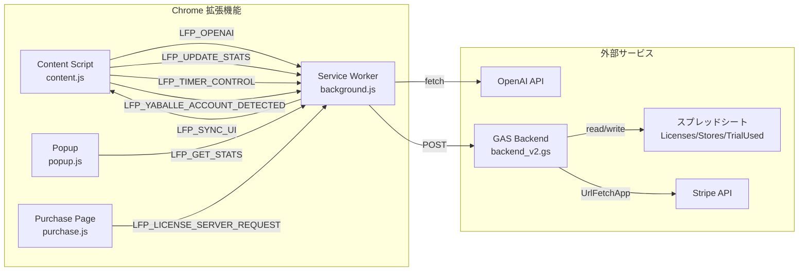

# ListerFlow Pro アーキテクチャガイド

## 概要

**ListerFlow Pro for Yaballe** は、eBay 向け出品ツール Yaballe での作業を効率化する Chrome 拡張機能。AI タイトル最適化、VeRO 検知、全自動出品（ターボモード）、サブスクリプション課金を提供する。

---

## 1. ファイル構成と役割

```
listerflow-pro-for-yaballe-sabscription/
├── manifest.json                    # Chrome 拡張設定（Manifest V3）
├── README.md                        # ユーザー向けドキュメント
├── LICENSE                          # 商用ライセンス
├── assets/icons/                    # 拡張機能アイコン
├── src/
│   ├── sw/
│   │   └── background.js           # Service Worker（中継局 + タイマー管理）
│   ├── content/
│   │   ├── content.js              # Content Script（Yaballe操作 + UI描画）
│   │   ├── content.css             # 作業画面内の注入CSS
│   │   └── modules/               # content.js のモジュール分割
│   ├── popup/
│   │   ├── popup.html              # ポップアップ画面
│   │   ├── popup.js                # ポップアップロジック（設定・統計）
│   │   ├── popup.css               # ポップアップスタイル
│   │   ├── popup_patch.js          # パッチ（段階的統合予定）
│   │   ├── export.html/js/css      # 履歴エクスポート画面
│   ├── pages/
│   │   ├── purchase.html           # 購入ページ（拡張機能内タブ）
│   │   ├── purchase.js             # 購入ロジック（Stripe連携）
│   │   └── purchase.css            # 購入ページスタイル
├── gas/
│   └── backend_v2.gs               # GAS バックエンド（Stripe + ライセンス管理）
└── github-pages/
    └── index.html                   # ランディングページ（GitHub Pages）
```

---

## 2. データフロー



---

## 3. メッセージタイプ一覧

### Content Script / Pages → Service Worker

| type | 用途 | 非同期 |
|---|---|---|
| `LFP_OPENAI` | OpenAI API 呼び出し | ✅ |
| `LFP_TIMER_CONTROL` | タイマー開始/停止 | ✅ |
| `LFP_UPDATE_STATS` | 出品完了時の統計更新 | ✅ |
| `LFP_UPDATE_INPUT_TIME` | ASIN入力時刻の更新 | ✅ |
| `LFP_SYNC_REQUEST` | UI同期リクエスト | ❌ |
| `LFP_HEARTBEAT` | Service Worker 生存確認 | ❌ |
| `LFP_GET_STATS` | 統計情報取得 | ✅ |
| `RESET_STATS` | 統計情報リセット | ✅ |
| `CLEAR_HISTORY` | ASIN履歴クリア | ✅ |
| `LFP_YABALLE_ACCOUNT_DETECTED` | Yaballe アカウント検知 | ✅ |
| `LFP_LICENSE_SERVER_REQUEST` | GAS サーバーへのリクエスト中継 | ✅ |

### Service Worker → Content Script

| type | 用途 |
|---|---|
| `LFP_SYNC_UI` | UI再描画トリガー |
| `LFP_ACCOUNT_CHANGED` | アカウント切り替え通知 |

---

## 4. GAS API エンドポイント

`LFP_LICENSE_SERVER_REQUEST` 経由で送るアクション一覧。

| action | 用途 | 入力 | 出力 |
|---|---|---|---|
| `create_checkout` | Checkout Session 作成 | `{ email, plan }` | `{ url }` |
| `check_trial_eligibility` | トライアル資格確認 | `{ email }` | `{ eligible, trialUsed, hasActiveSubscription }` |
| `apply_license` | ライセンスキー認証 | `{ email, licenseKey }` | `{ plan }` |
| `check_trial` | ライセンス状態確認 | `{ email }` | `{ plan, cancelAt, nextBillingDate, ... }` |
| `create_portal_session` | カスタマーポータルURL取得 | `{ email }` | `{ portalUrl }` |

---

## 5. chrome.storage キー一覧

### sync（デバイス間同期）

| キー | 型 | 内容 |
|---|---|---|
| `lfp_options_v1` | Object | 設定値（apiKey, model, 各種トグル） |

### local（ローカル専用）

| キー | 型 | 内容 |
|---|---|---|
| `lfp_stats_v1` | Object | 統計情報（todayListings, totalWorkTimeToday 等） |
| `lfp_asin_history_v1` | Array | ASIN 出品履歴 |
| `lfp_license_v1` | Object | ライセンス情報（plan, licenseKey, usageCount） |
| `lfp_license_plan` | String | 現在のプラン（`free`/`pro`/`premium`） |
| `lfp_current_yaballe_email` | String | 現在の Yaballe アカウントメール |
| `lfp_licenses_by_account` | Object | アカウント別ライセンス辞書 |
| `lfp_pro_trial_start_date` | String | ローカルトライアル開始日 |
| `lfp_turbo_auto_disabled` | Boolean | Turbo 自動OFF フラグ |
| `lfp_turbo_auto_disabled_{email}` | Boolean | アカウント別 Turbo 自動OFF |

---

## 6. デプロイ手順

### GAS バックエンド

1. GAS エディタでコードを更新
2. **デプロイ** → **デプロイを管理** → 鉛筆アイコン
3. **バージョン**: **新しいバージョン** を選択 → **デプロイ**
4. URL は変わらない（バージョンが切り替わるだけ）

### Chrome 拡張機能

1. ファイルを編集・保存
2. `chrome://extensions/` → ListerFlow Pro の **リロード** ボタン
3. Yaballe のタブをリロード

### Stripe 設定変更

1. Stripe Dashboard → 設定変更
2. 必要に応じて Webhook エンドポイントのイベントを追加
3. テストモードで動作確認後、ライブモードに切替

---

## 7. 環境切替

| 項目 | テスト | 本番 |
|---|---|---|
| Stripe Key | `sk_test_...` | `sk_live_...` |
| Price ID | テスト用 `price_...` | 本番用 `price_...` |
| GAS URL | テストデプロイ URL | 本番デプロイ URL |
| ポータル URL | `test_` 付き | 本番用 |

> **注意**: GAS のスクリプトプロパティを切り替えるだけで OK。コード変更は不要。
