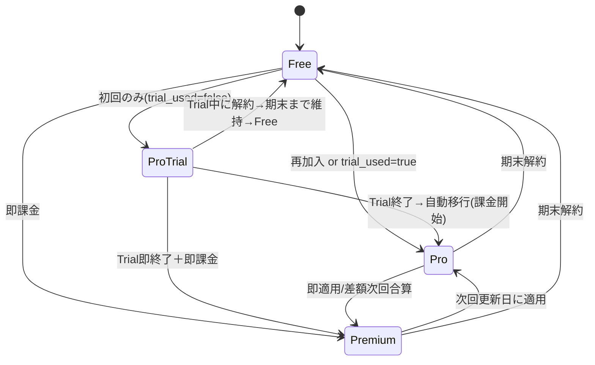

# サブスクリプションライフサイクル管理

## 概要

Stripe のサブスクリプションを GAS（Google Apps Script）のスプレッドシートで管理し、Chrome 拡張機能で UI を動的に切り替えるパターン。

---

## 1. 状態遷移図



---

## 2. スプレッドシート DB 設計

### Licenses シート

| 列 | ヘッダー | 内容 | 例 |
|---|---|---|---|
| A | Key | ライセンスキー | `LFP-A1B2C3D4` |
| B | Plan | `pro` / `premium` | `pro` |
| C | BuyerEmail | 購入者メール | `user@example.com` |
| D | Status | `active` / `expired` | `active` |
| E | CreatedAt | 作成日時 | `2026-03-01T...` |
| F | AuthorizedEmail | 認証済みメール | `user@example.com` |
| G | SubID | Stripe Subscription ID | `sub_xxx` |
| H | GraceDeadline | 支払い猶予期限 | `2026-03-08T...` |
| I | CancelAt | 解約予定日 | `2026-04-01T...` |

### TrialUsed シート

| 列 | ヘッダー | 内容 |
|---|---|---|
| A | Email | メールアドレス |
| B | Used Date | トライアル使用日時 |
| C | Subscription ID | サブスクリプション ID |
| D | Plan | プラン名 |

### Stores シート（購入記録）

| 列 | ヘッダー | 内容 |
|---|---|---|
| A | Date | 購入日時 |
| B | Email | メールアドレス |
| C | Plan | プラン名 |
| D | Amount | 金額 |
| E | SessionID | Stripe Session ID（冪等性チェック用） |
| F | LicenseKey | 発行したキー |
| G | SubscriptionID | サブスクリプション ID |

---

## 3. Webhook イベント → ハンドラ マッピング

| Stripe イベント | GAS ハンドラ | 処理内容 |
|---|---|---|
| `checkout.session.completed` | `handleStripeWebhook` | ライセンス発行、メール送信、trial_used 記録 |
| `customer.subscription.updated` | `handleSubscriptionUpdated` | プラン変更反映、past_due 猶予、cancel_at 記録 |
| `customer.subscription.deleted` | `handleSubscriptionDeleted` | ライセンス失効 |
| `charge.refunded` | `handleChargeRefunded` | ライセンス失効 |
| `charge.dispute.created` | `handleChargeDispute` | ログ記録（手動対応） |

---

## 4. 主要パターン

### パターン A: 猶予期間（Grace Period）

支払い失敗（`past_due`）時に即座に権限を剥奪せず、7日間の猶予を設ける。

```javascript
// Webhook: customer.subscription.updated
if (status === 'past_due') {
  const deadline = new Date();
  deadline.setDate(deadline.getDate() + 7);
  setGraceDeadlineBySubscriptionId(subId, deadline);
}

// ライセンス確認時: handleCheckTrial
if (rows[i][7]) { // H列 = GraceDeadline
  if (new Date() > new Date(rows[i][7])) {
    // 猶予期限超過 → expired に変更
    sheet.getRange(i + 1, 4).setValue('expired');
    continue; // 次の行を検索
  }
}
```

### パターン B: 解約予定日管理

ユーザーが解約すると Stripe は `cancel_at_period_end=true` を設定する。期末までは権限を維持し、UI に解約予定を表示する。

```javascript
// Webhook: customer.subscription.updated
if (sub.cancel_at_period_end === true && sub.cancel_at) {
  const cancelAtDate = new Date(sub.cancel_at * 1000);
  setCancelAtBySubscriptionId(subId, cancelAtDate);
} else if (sub.cancel_at_period_end === false) {
  // 解約キャンセル（復活）
  clearCancelAtBySubscriptionId(subId);
}

// UI側での表示（Content Script / Popup）
if (result.cancelAt) {
  const d = new Date(result.cancelAt);
  badge.textContent += ` (${d.getMonth()+1}/${d.getDate()}解約予定)`;
}
```

### パターン C: プラン変更の DB 反映

Stripe カスタマーポータル経由のプラン変更は `checkout.session.completed` を発火しない。`customer.subscription.updated` で検知する。

```javascript
if (status === 'active' || status === 'trialing') {
  clearGraceDeadlineBySubscriptionId(subId);
  const priceId = sub.items?.data?.[0]?.price?.id;
  if (priceId) {
    const newPlan = determinePlanFromPriceId(priceId);
    if (newPlan) updateLicensePlanBySubscriptionId(subId, newPlan);
  }
}
```

### パターン D: 二重サブスク防止（3層ガード）

```
Layer 1: Checkout 作成時 → hasActiveSubscription(email) で弾く
Layer 2: Webhook 到着時  → Session ID で冪等性チェック
Layer 3: プラン更新時   → 同一メールの古い active を expired に変更
```

---

## 5. 購入ページ UI の動的切替

ユーザーの状態に応じて購入ページの表示を切り替えるパターン。

| 状態 | バナー表示 | ボタンテキスト | ボタン動作 |
|---|---|---|---|
| トライアル未使用 | 「1ヶ月無料で試してみる」 | 「Proを無料で始める」 | Checkout (Trial付き) |
| トライアル使用済み | 「💳 初月から ¥2,980/月」 | 「Proプランを開始する」 | Checkout (即時課金) |
| アクティブサブスク | 「✅ アクティブなプランご利用中」 | 「プランを管理する」 | カスタマーポータル |

```javascript
// 状態判定フロー
const emailData = await chrome.storage.local.get(['current_email']);
const email = emailData.current_email;

const response = await chrome.runtime.sendMessage({
  type: "SERVER_REQUEST",
  payload: { action: "check_trial_eligibility", email }
});

if (response.data.hasActiveSubscription) {
  updateUIForActiveSubscription();
} else if (response.data.trialUsed) {
  updateUIForTrialUsed();
} else {
  // デフォルト（トライアル表示）
}
```

---

## 6. 仕様差分分析テンプレート

新機能追加時に「理想仕様」と「現状実装」の差分を整理するためのテンプレート。

```markdown
| # | 理想仕様 | 現状実装 | 問題 | 修正難易度 | 修正箇所 |
|---|---------|---------|------|-----------|---------|
| D1 | ○○のとき△△する | ××のまま変わらない | ❌ ユーザー混乱 | 中 | backend_v2.gs |
| D2 | ... | ... | ⚠️ ... | 低 | ... |
```

---

## よくあるハマりポイント

| 問題 | 原因 | 対策 |
|---|---|---|
| ポータルでプラン変更してもバッジが変わらない | `subscription.updated` で DB を更新していない | `handleSubscriptionUpdated` でプラン列を更新 |
| 解約したのにUIに反映されない | `cancel_at_period_end` を処理していない | Webhook で CancelAt 列に記録 |
| past_due でも使い続けられる | 猶予期限チェックがない | `handleCheckTrial` で猶予超過チェック |
| 2回目のトライアルが取得できてしまう | `markTrialUsed()` のタイミングが遅い | Checkout Session 作成直後に即記録 |
